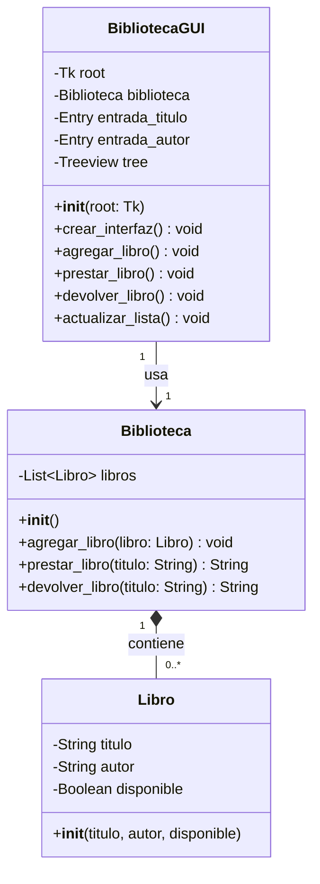
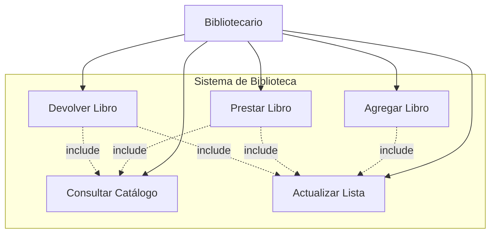
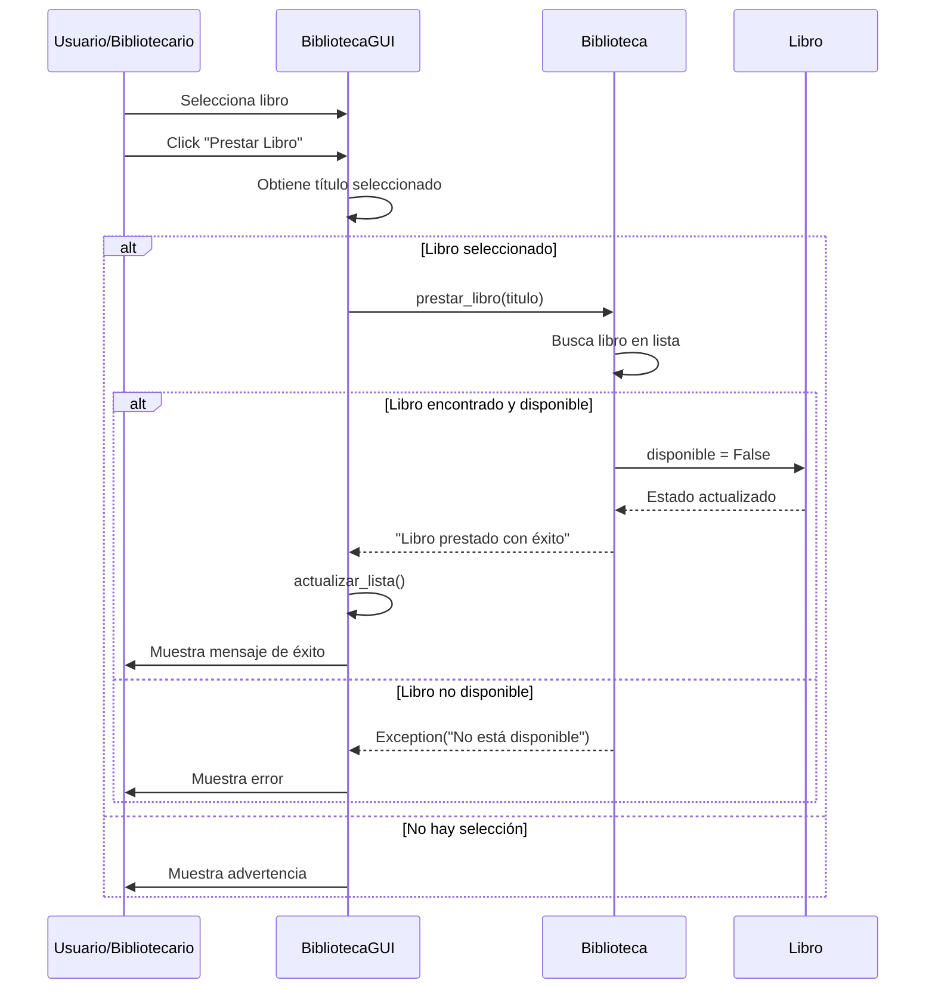
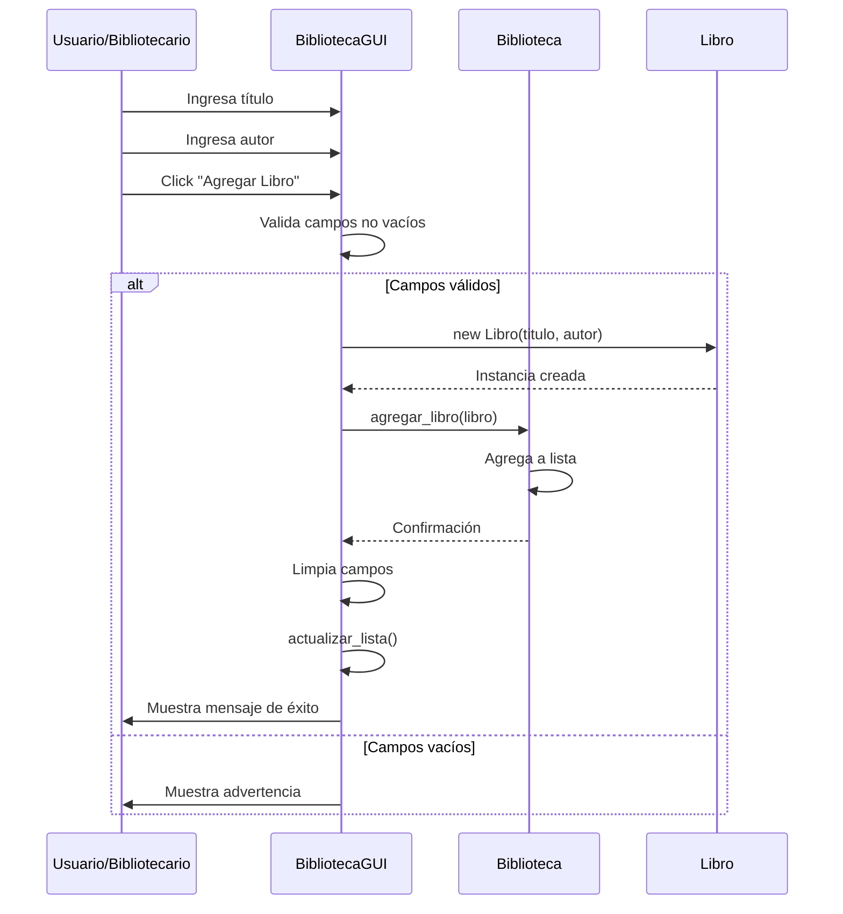
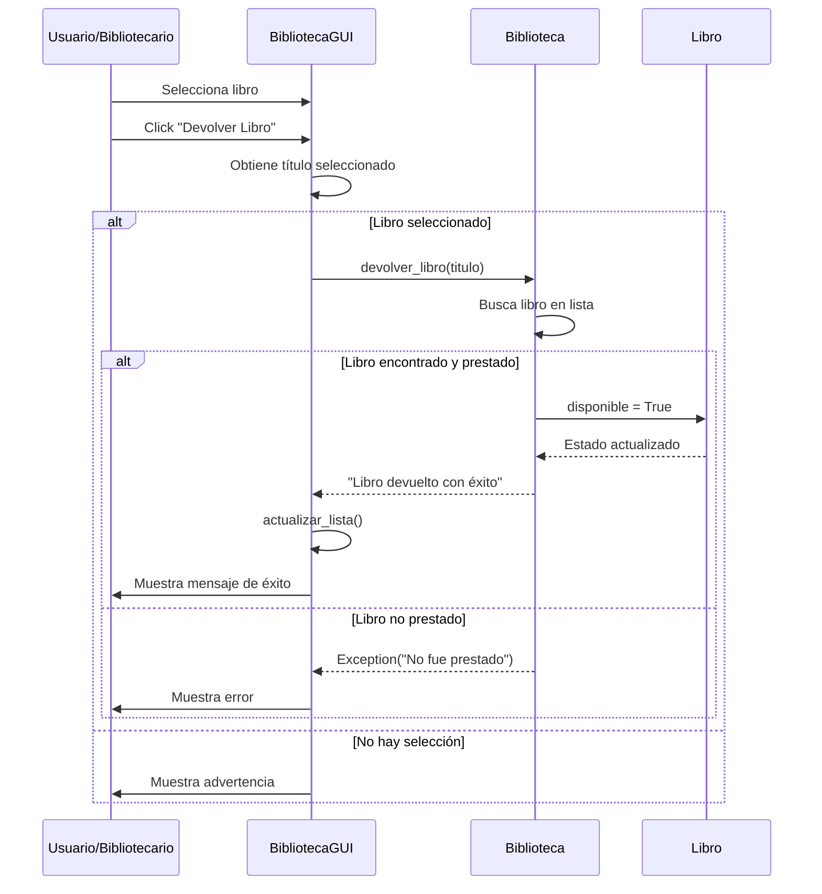
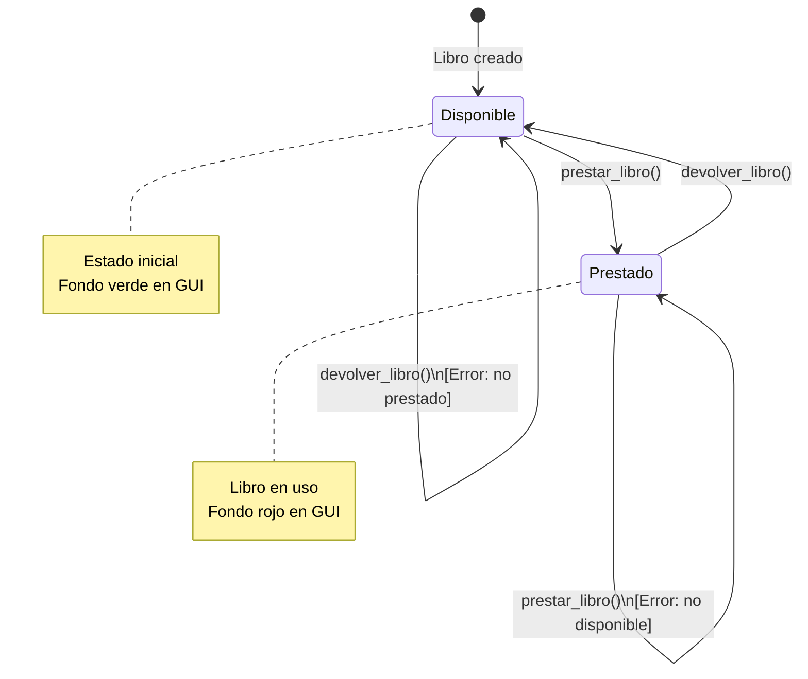
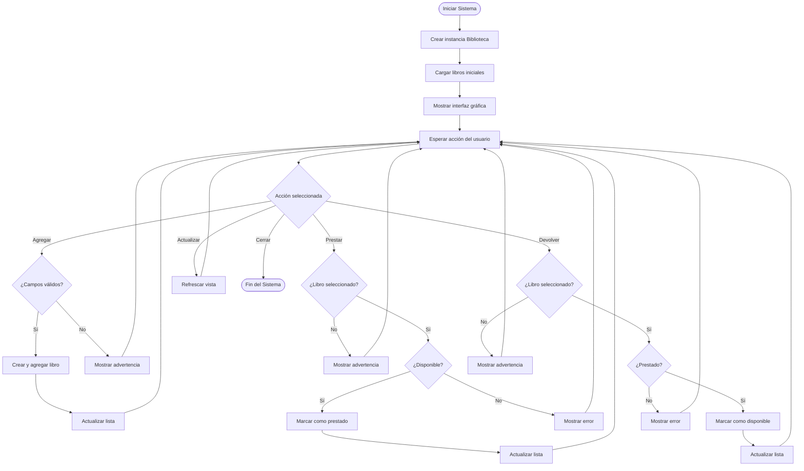
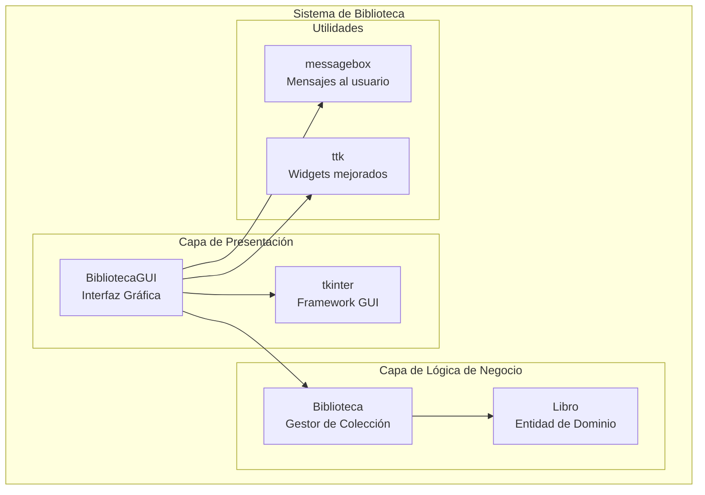
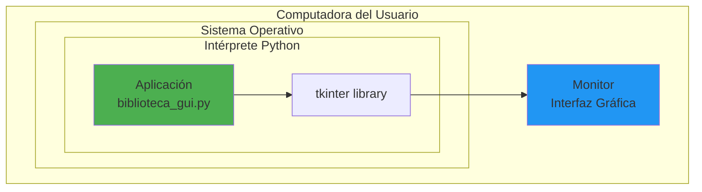

# ANÁLISIS DEL SISTEMA DE GESTIÓN DE BIBLIOTECA

## 1. INTRODUCCIÓN

El Sistema de Gestión de Biblioteca es una aplicación de escritorio desarrollada en Python con interfaz gráfica que permite administrar el inventario de libros y controlar su disponibilidad mediante operaciones de préstamo y devolución.

---

## 2. OBJETIVOS

### 2.1 Objetivo General

Desarrollar un sistema informático que permita gestionar eficientemente el inventario de libros de una biblioteca, facilitando el control de préstamos y devoluciones mediante una interfaz gráfica intuitiva y funcional.

### 2.2 Objetivos Específicos

1. Implementar un módulo de registro que permita agregar nuevos libros al catálogo de la biblioteca con información básica (título y autor).

2. Desarrollar un sistema de visualización que muestre el inventario completo de libros con su estado de disponibilidad en tiempo real.

3. Crear funcionalidades de préstamo que validen la disponibilidad de los libros antes de ser entregados a los usuarios.

4. Implementar un sistema de devolución que actualice automáticamente el estado de disponibilidad de los libros.

5. Diseñar una interfaz gráfica amigable que minimice la curva de aprendizaje para los usuarios del sistema.

6. Incorporar validaciones y manejo de errores que garanticen la integridad de la información y mejoren la experiencia del usuario.

---

## 3. ALCANCE DEL PROYECTO

### 3.1 Dentro del Alcance

- Registro de libros con información básica (título, autor)
- Visualización del catálogo completo de libros
- Gestión de préstamos de libros
- Gestión de devoluciones de libros
- Validación de disponibilidad
- Interfaz gráfica de usuario
- Indicadores visuales del estado de los libros
- Mensajes de retroalimentación al usuario

### 3.2 Fuera del Alcance

- Registro de usuarios o lectores
- Sistema de reservas
- Control de fechas de préstamo y devolución
- Multas por retraso
- Historial de préstamos
- Búsqueda avanzada de libros
- Generación de reportes estadísticos
- Base de datos persistente (los datos se pierden al cerrar la aplicación)
- Sistema de autenticación
- Gestión de múltiples copias del mismo libro

---

## 4. ANÁLISIS DE REQUERIMIENTOS

### 4.1 Requerimientos Funcionales

**RF-01: Agregar Libros**
- El sistema debe permitir ingresar nuevos libros al catálogo
- Debe solicitar título y autor como información obligatoria
- Debe validar que los campos no estén vacíos
- Debe confirmar la adición exitosa mediante mensaje

**RF-02: Visualizar Catálogo**
- El sistema debe mostrar todos los libros registrados en formato de tabla
- Debe mostrar: título, autor y estado de disponibilidad
- Debe actualizar la visualización automáticamente después de cada operación
- Debe diferenciar visualmente libros disponibles de prestados

**RF-03: Prestar Libros**
- El sistema debe permitir seleccionar un libro del catálogo
- Debe validar que el libro esté disponible antes de prestarlo
- Debe cambiar el estado del libro a "Prestado"
- Debe mostrar mensaje de error si el libro ya está prestado
- Debe mostrar mensaje de error si el libro no existe

**RF-04: Devolver Libros**
- El sistema debe permitir devolver libros prestados
- Debe validar que el libro efectivamente esté prestado
- Debe cambiar el estado del libro a "Disponible"
- Debe mostrar mensaje de error si el libro no estaba prestado
- Debe confirmar la devolución exitosa

**RF-05: Actualización de Datos**
- El sistema debe actualizar la lista de libros en tiempo real
- Debe permitir actualización manual mediante botón específico

**RF-06: Validaciones**
- El sistema debe validar que los campos de entrada no estén vacíos
- Debe prevenir operaciones inválidas (prestar libro ya prestado, devolver libro disponible)
- Debe validar la existencia del libro antes de cualquier operación

### 4.2 Requerimientos No Funcionales

**RNF-01: Usabilidad**
- La interfaz debe ser intuitiva y fácil de usar
- Los elementos deben estar organizados lógicamente
- Los mensajes de error deben ser claros y descriptivos
- El tiempo de respuesta para cada operación no debe exceder 1 segundo

**RNF-02: Confiabilidad**
- El sistema debe manejar todos los errores sin cerrarse inesperadamente
- Debe mantener la consistencia de datos durante toda la sesión
- Debe prevenir operaciones que comprometan la integridad de los datos

**RNF-03: Mantenibilidad**
- El código debe seguir principios de programación orientada a objetos
- Debe estar organizado en clases con responsabilidades específicas
- Debe ser fácilmente extensible para futuras funcionalidades

**RNF-04: Portabilidad**
- El sistema debe ejecutarse en sistemas operativos Windows, Linux y macOS
- Debe utilizar bibliotecas estándar de Python para maximizar compatibilidad

**RNF-05: Rendimiento**
- El sistema debe manejar eficientemente hasta 1000 libros sin degradación perceptible
- La actualización de la interfaz debe ser fluida

**RNF-06: Visual**
- Los libros disponibles deben mostrarse con fondo verde
- Los libros prestados deben mostrarse con fondo rojo
- Los botones deben tener colores distintivos según su función

---

## 5. CASOS DE USO

### CU-01: Agregar Nuevo Libro

**Actor Principal:** Bibliotecario

**Precondiciones:** El sistema está en ejecución

**Flujo Principal:**
1. El bibliotecario ingresa el título del libro
2. El bibliotecario ingresa el autor del libro
3. El bibliotecario presiona el botón "Agregar Libro"
4. El sistema valida que los campos no estén vacíos
5. El sistema agrega el libro al catálogo
6. El sistema muestra mensaje de éxito
7. El sistema actualiza la lista de libros
8. El sistema limpia los campos de entrada

**Flujos Alternativos:**
- 4a. Si algún campo está vacío:
  - El sistema muestra mensaje de advertencia
  - Se retorna al paso 1

### CU-02: Prestar Libro

**Actor Principal:** Bibliotecario

**Precondiciones:** 
- El sistema está en ejecución
- Existen libros en el catálogo

**Flujo Principal:**
1. El bibliotecario selecciona un libro de la lista
2. El bibliotecario presiona el botón "Prestar Libro"
3. El sistema valida que el libro esté disponible
4. El sistema marca el libro como prestado
5. El sistema muestra mensaje de éxito
6. El sistema actualiza la lista (libro aparece en rojo)

**Flujos Alternativos:**
- 1a. Si no hay libro seleccionado:
  - El sistema muestra mensaje de advertencia
- 3a. Si el libro ya está prestado:
  - El sistema muestra mensaje de error
  - La operación se cancela
- 3b. Si el libro no existe:
  - El sistema muestra mensaje de error
  - La operación se cancela

### CU-03: Devolver Libro

**Actor Principal:** Bibliotecario

**Precondiciones:** 
- El sistema está en ejecución
- Existen libros prestados en el catálogo

**Flujo Principal:**
1. El bibliotecario selecciona un libro de la lista
2. El bibliotecario presiona el botón "Devolver Libro"
3. El sistema valida que el libro esté prestado
4. El sistema marca el libro como disponible
5. El sistema muestra mensaje de éxito
6. El sistema actualiza la lista (libro aparece en verde)

**Flujos Alternativos:**
- 1a. Si no hay libro seleccionado:
  - El sistema muestra mensaje de advertencia
- 3a. Si el libro no estaba prestado:
  - El sistema muestra mensaje de error
  - La operación se cancela

### CU-04: Consultar Catálogo

**Actor Principal:** Bibliotecario

**Precondiciones:** El sistema está en ejecución

**Flujo Principal:**
1. El bibliotecario visualiza la lista de libros
2. El sistema muestra todos los libros con su estado
3. El bibliotecario identifica visualmente libros disponibles (verde) y prestados (rojo)

---

## 6. ARQUITECTURA DEL SISTEMA

### 6.1 Patrón de Diseño

El sistema utiliza el patrón **Modelo-Vista-Controlador (MVC) simplificado**:

- **Modelo:** Clases `Libro` y `Biblioteca` (lógica de negocio y datos)
- **Vista:** Componentes de tkinter (interfaz gráfica)
- **Controlador:** Clase `BibliotecaGUI` (coordina modelo y vista)

### 6.2 Componentes Principales

**Clase Libro**
- Responsabilidad: Representar un libro individual
- Atributos: titulo, autor, disponible
- Métodos: Constructor

**Clase Biblioteca**
- Responsabilidad: Gestionar la colección de libros
- Atributos: lista de libros
- Métodos: agregar_libro, prestar_libro, devolver_libro

**Clase BibliotecaGUI**
- Responsabilidad: Gestionar la interfaz y coordinar operaciones
- Métodos: crear_interfaz, agregar_libro, prestar_libro, devolver_libro, actualizar_lista

---

## 7. ESPECIFICACIONES TÉCNICAS

### 7.1 Tecnologías Utilizadas

- **Lenguaje:** Python 3.x
- **Framework GUI:** tkinter (biblioteca estándar)
- **Paradigma:** Programación Orientada a Objetos

### 7.2 Requisitos del Sistema

**Hardware Mínimo:**
- Procesador: 1 GHz o superior
- RAM: 512 MB
- Espacio en disco: 50 MB

**Software:**
- Python 3.6 o superior
- Sistema Operativo: Windows 7+, Linux, macOS 10.12+

---

## 8. MODELO DE DATOS

### 8.1 Estructura de Datos

**Entidad: Libro**
```
- titulo: String (obligatorio)
- autor: String (obligatorio)
- disponible: Boolean (por defecto: True)
```

**Entidad: Biblioteca**
```
- libros: Lista de objetos Libro
```

### 8.2 Reglas de Negocio

1. Un libro solo puede estar en dos estados: Disponible o Prestado
2. No se puede prestar un libro que ya está prestado
3. No se puede devolver un libro que está disponible
4. Todos los libros nuevos inician como disponibles
5. Un libro debe tener título y autor para ser agregado
6. No hay límite en la cantidad de libros que se pueden agregar

---

## 9. PLAN DE PRUEBAS

### 9.1 Pruebas Funcionales

**Prueba 1: Agregar libro con datos válidos**
- Entrada: Título="Don Quijote", Autor="Cervantes"
- Resultado esperado: Libro agregado y visible en la lista

**Prueba 2: Agregar libro con campos vacíos**
- Entrada: Título="", Autor=""
- Resultado esperado: Mensaje de advertencia

**Prueba 3: Prestar libro disponible**
- Entrada: Seleccionar libro disponible
- Resultado esperado: Estado cambia a "Prestado", fondo rojo

**Prueba 4: Prestar libro ya prestado**
- Entrada: Seleccionar libro prestado
- Resultado esperado: Mensaje de error

**Prueba 5: Devolver libro prestado**
- Entrada: Seleccionar libro prestado
- Resultado esperado: Estado cambia a "Disponible", fondo verde

**Prueba 6: Devolver libro disponible**
- Entrada: Seleccionar libro disponible
- Resultado esperado: Mensaje de error

### 9.2 Pruebas de Usabilidad

- Verificar que todos los botones respondan al clic
- Confirmar que los mensajes sean claros y comprensibles
- Validar que los colores sean distinguibles
- Comprobar que la interfaz sea responsive

---

## 10. LIMITACIONES CONOCIDAS

1. **Persistencia de datos:** Los datos no se guardan al cerrar la aplicación
2. **Libros duplicados:** El sistema permite agregar libros con el mismo título
3. **Búsqueda:** No existe funcionalidad de búsqueda o filtrado
4. **Usuarios:** No hay registro de quién prestó cada libro
5. **Fechas:** No se registran fechas de préstamo ni devolución
6. **Copias múltiples:** No se pueden gestionar múltiples ejemplares del mismo libro
7. **Escalabilidad:** El rendimiento puede degradarse con más de 1000 libros

---

## 11. MEJORAS FUTURAS

### 11.1 Corto Plazo
- Implementar persistencia de datos (JSON o SQLite)
- Agregar funcionalidad de búsqueda por título o autor
- Incluir campo ISBN
- Permitir edición de libros existentes
- Agregar opción para eliminar libros

### 11.2 Mediano Plazo
- Implementar sistema de usuarios/lectores
- Agregar control de fechas de préstamo y devolución
- Crear sistema de recordatorios
- Generar reportes básicos
- Implementar categorías o géneros literarios

### 11.3 Largo Plazo
- Desarrollar versión web
- Crear aplicación móvil
- Implementar sistema de reservas
- Agregar código de barras/QR
- Sistema de multas automático
- Estadísticas y dashboards
- Integración con catálogos en línea

---

## 12. DIAGRAMAS UML

### 12.1 Diagrama de Clases



**Descripción:**
- La clase `Biblioteca` tiene una relación de composición con `Libro` (un libro no puede existir sin biblioteca en este contexto)
- La clase `BibliotecaGUI` tiene una relación de dependencia con `Biblioteca` (la usa para todas las operaciones)

### 12.2 Diagrama de Casos de Uso



**Descripción:**
- Actor único: Bibliotecario
- 5 casos de uso principales
- Relaciones de inclusión: algunas operaciones requieren actualizar o consultar la lista

### 12.3 Diagrama de Secuencia - Prestar Libro



### 12.4 Diagrama de Secuencia - Agregar Libro



### 12.5 Diagrama de Secuencia - Devolver Libro



### 12.6 Diagrama de Estados - Libro



**Descripción:**
- Un libro tiene solo 2 estados posibles
- Las transiciones inválidas generan excepciones
- El estado inicial siempre es "Disponible"

### 12.7 Diagrama de Actividades - Flujo General del Sistema



### 12.8 Diagrama de Componentes



**Descripción:**
- Arquitectura en capas
- Separación clara entre presentación y lógica de negocio
- Uso de bibliotecas estándar de Python

### 12.9 Diagrama de Despliegue



**Descripción:**
- Aplicación de escritorio standalone
- No requiere servidor
- No requiere conexión a internet
- Ejecución local en la máquina del usuario

---

## 13. CONCLUSIÓN

El Sistema de Gestión de Biblioteca cumple con los objetivos establecidos al proporcionar una herramienta funcional y fácil de usar para la gestión básica de préstamos de libros. Si bien presenta limitaciones en cuanto a persistencia de datos y funcionalidades avanzadas, constituye una base sólida que puede ser expandida según las necesidades específicas de cada biblioteca.

El diseño modular y la arquitectura orientada a objetos facilitan futuras extensiones y mejoras, permitiendo que el sistema evolucione de acuerdo a los requerimientos del usuario final.